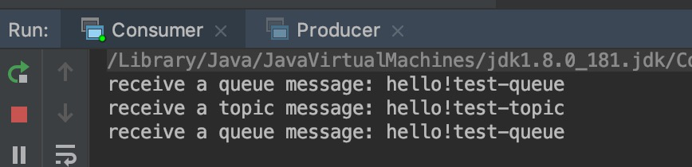

# 消息队列培训-第一课时(ActiveMQ&amp;JMS示例)

通过如下步骤演示消息队列的应用，以及ActiveMQ&JMS的基本用法。

## 1. 安装ActiveMQ

### 1.1 准备条件

系统需要预先安装JDK8+，Maven3+，git工具(git命令行或tortoiseGit，IDE自带工具等)，并已经配置好环境变量。

### 1.2 下载Zookeeper

可以通过下列链接手动下载：

http://ftp.jaist.ac.jp/pub/apache/zookeeper/zookeeper-3.4.14/zookeeper-3.4.14.tar.gz

Linux/Mac也可以通过如下命令下载：

> wget http://ftp.jaist.ac.jp/pub/apache/zookeeper/zookeeper-3.4.14/zookeeper-3.4.14.tar.gz

### 1.3 下载ActiveMQ

Linux/Mac也可以通过如下命令下载：

> wget http://ftp.jaist.ac.jp/pub/apache/activemq/5.15.9/apache-activemq-5.15.9-bin.tar.gz

## 2. 启动ActiveMQ broker

### 2.1 启动Zookeeper

Window上直接解压zip文件。

Linux/Mac上使用：

> $ tar xvzf zookeeper-3.4.14.tar.gz
>
> $ cd zookeeper-3.4.14
>
> $ mv conf/zoo_sample.cfg  conf/zoo.cfg
>
> $ $ ./bin/zkServer.sh start
>
> ZooKeeper JMX enabled by default
>
> Using config: /Users/kimmking/kk/huobidev/zookeeper-3.4.14/bin/../conf/zoo.cfg
>
> Starting zookeeper ... STARTED

出现“*Starting zookeeper ... STARTED*”就说明启动成功了。

### 2.2 启动ActiveMQ

Window上直接解压zip文件。

Linux/Mac上使用：

> $ tar xvzf apache-activemq-5.15.9-bin.tar.gz
>
> $ cd apache-activemq-5.15.9/
>
> $ ./bin/activemq start
>
> ... ... 
>
> INFO: pidfile created : '/Users/kimmking/kk/huobidev/apache-activemq-5.15.9//data/activemq.pid' (pid '89168')

看到提示“*pidfile created*”就说明启动成功了。

此时可以在浏览器输入：http://localhost:8161/admin/

## 3. 下载demo代码

### 3.1 下载代码

在命令行或IDE工具里：

> git clone git@github.com:huobidev/training-mq-01.git

### 3.2 导入代码

然后，可以把代码导入到IDE里，比如IntelliJ IDEA。

## 4. 发送消息

IDE中运行Producer类。然后在网页控制台上点击Queues菜单，可以看到：

上述两字数字表示目前MQ里入队了一个消息，目前还有一个消息等待消费。

点击Browser，再点击Message ID，可以看到消息的具体内容。

点击菜单栏的Topic，可以看到test-topic中入队过一个消息：

## 5. 接收消息

在IDE里运行Consumer，可以从输出看到如下信息：

这表明我们的Consumer程序收到了上个环节发出的queue里的消息。

现在我们再来运行一次Producer程序，然后可以看到Consumer的输出窗口又多出来两个消息信息打印：

这说明我们同时接收到了Topic和Queue的消息。

## 6. 作业题

现在请同学们：

1. 先停止Producer和Consumer程序

2. 然后在Consumer代码里再多创建一个topicConsumer2和QueueConsumer2，也分别订阅topicName和queueName这两个
3. 接着先启动Consumer程序
4. 再启动Producer程序
5. 此时Consumer的输出窗口，有几条消息输出信息，topic几条，queue几条
6. 请把上面的三个数字，写在答题纸上，例如一共两条消息，topic一条，queue一条，那么就写：2  1  1 

